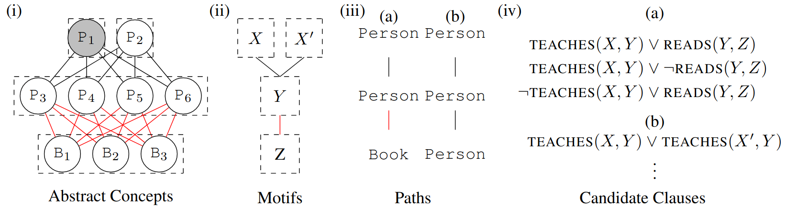

# PRISM
**PR**incipled **I**dentification of **S**tructural **M**otif is a framework for identifying structural motifs in relational data. This is an implementation of the algorithms described in the paper *"Principled and Efficient Motif Finding for Structure Learning in Lifted Graphical Models" by Jonathan Feldstein, Dominic Phillips and Efthymia Tsamoura, AAAI 2023*. It is implemented in C++ and highly parallelized to allow for faster computations.



**Structure Learning Pipeline:** The above shows an example of a dataset about a class, where entities are people or books. Black edges represent $\textsc{teaches}(X,Y)$, and grey edges represent $\textsc{reads}(Y,Z)$: (i) The resulting higher-level concepts, where red concepts represent teachers, blue concepts represent students, and grey concepts are books (ii) the resulting structural motif, (iii) the paths found in the motif (in this case one), and (iv) mined candidate clauses.

This README should provide you the necessary understanding to run examples using this library and build upon it further. If you do use this library, please cite accordingly.
This README consists of the following sections:

1. [A brief technical overview](#a-brief-technical-overview)
2. [The library structure](#the-library-structure)
3. [How to install PRISM?](#how-to-install-PRISM)
4. [How to run the examples?](#how-to-run-the-examples)
5. [How to set up your own experiments?](#how-to-set-up-your-own-experiments)

## A brief technical overview

In this section, we briefly describe what PRISM can be used for and the underlying technical steps that are used to find structural motifs. For a detailed description and a more fundamental mathematical understanding, please consult *"Principled and Efficient Motif Finding for Structure Learning in Lifted Graphical Models" by Jonathan Feldstein, Dominic Phillips and Efthymia Tsamoura, AAAI 2023*.

**Structure learning** is a core problem in AI central to the fields of **neuro-symbolic AI** and **statistical relational learning**. It consists in automatically learning a logical theory from data. The basis for structure learning is mining repeating patterns in the data, known as **structural motifs**. Finding these patterns reduces the exponential search space and therefore guides the learning of formulas. Despite the importance of motif learning, it is still not well understood. We present the first principled approach for mining structural motifs in **lifted graphical models**, languages that blend first-order logic with probabilistic models, which uses a stochastic process to measure the similarity of entities in the data.

**PRISM** takes the following steps to find structural motifs:

#### 1. Transform data into a hypergraph

The input to PRISM is data in form of a relational database. A **relational database** $\mathcal{D}$ can be represented by a hypergraph $\mathcal{H} = (V,E)$ by defining $V$ to be the union of the constants in $\mathcal{D}$, and defining $E$ such that every $k$ -ary ground atom $R(c_1,\dots,c_k)$ in $\mathcal{D}$ becomes a hyperedge $e \in E$, with label $R$, whose elements are the nodes corresponding to the constants $c_1,\dots,c_n$.  

#### 2. Perform hierarchical clustering of the hypergraph

We then pre-process the data through hierarchical clustering. This identifies groups of densely-connected nodes. The motivation behind considering only densely-connected nodes is that spuriously-connected nodes appear rarely in the path signatures and therefore only add noise to the path signature counts that we use at a later stage for clustering nodes into *abstract concepts*. Furthermore, this pre-processing also leads to a computational saving as we show in our paper.

This hierarchical clustering algorithm is based on spectral clustering. 
In overview, we begin by converting a hypergraph $\mathcal{H}=(V,E)$ into a weighted graph $\mathcal{G}$ by expanding cliques over each hyperedge. Next, $\mathcal{G}$ is recursively bipartitioned using the sweep set approximation algorithm for the Cheeger-cut *(Chang, Shao, and Zhang 2017)*. The result of the partitioning is a set of subgraphs $G:=$ { $\mathcal{G}_1, \mathcal{G}_2, ..., \mathcal{G}_k$ }. The partitioning terminates whenever either the second-smallest eigenvalue of the symmetric Laplacian matrix $\lambda_2$ exceeds a threshold value $\lambda_2^{max}$.
$\lambda_2^{max}$ is dataset independent and thus fixed in our implementation.
Finally, each graph cluster $\mathcal{G}_i$ is then converted into a hypergraph $\mathcal{H}_i = (V_i, E_i)$ such that the vertex set $V_i$ of the hypergraph is initialised to be the vertex set of $\mathcal{G}_i$. The edge set $E_i$ is then constructed by adding all hyperedges $e \in E$ whose strict majority of element vertices appear in $V_i$, i.e. $E_i :=$ { $e \in E \vert \vert e \cap V_i \vert > \vert e\vert/2$}. As a consequence, no nodes nor edges are lost during clustering. 
This algorithm returns the set of hypergraph clusters { $\mathcal{H}_1, \mathcal{H}_2, ..., \mathcal{H}_k$ } obtained. After partitioning, we run the rest of the pipeline with $L$ set to the diameter of each hypergraph cluster.

#### 3. Run random walks from each node in the hypergraph

In a next step, we run $N$ random walks from each node. $N$ is computed given a user-defined $\varepsilon$. During each random walk, we store for each node that we encounter during the random walk the path signature of the path taken to reach the node for the first time from the source node of the random walk.

An upper bound on the $\varepsilon$-optimal number of random walks $N$ on $\mathcal{H}$ under $L$ is given by 

$\max$ { $(L-1)^2/4\varepsilon^2, P^\* (\gamma + \ln P^\*)/\varepsilon^2$ }, 

where ${P^\* = 1 + {e(e^{L}-1)}/({e-1}) \gg 1}$, $e$ is the number of unique edge labels in $\mathcal{H}$, and $\gamma \approx 0.577$ is the Euler-Mascheroni constant.

#### 4. Cluster nodes into *abstract concepts*

Finally, we cluster nodes in *abstract concepts*; collections of entities that have similar neighbourhoods in the hypergraph. Nodes are then partitioned into path-symmetric sets based on the similarity of their $L$-path signature counts. Each path-symmetric set then uniquely defines an abstract concept.

In practice, we separate the path-symmetry clustering into two steps. Firstly, we cluster nodes based on their distance symmetry and then based on their path symmetry. The stage of clustering by distance only serves to speed up the subsequent path-symmetric clustering. This is a valid approach since any path-symmetry implies distance symmetry, and checking distance symmetry is a faster algorithm ( $\mathcal{O}(N)$ vs $\mathcal{O}(N \ln (N))$ ).

## The library structure

#### Graphs

`./Graphs` contains a light C++ implemented graph library supporting both graphs and hypergraphs. 

##### `UndirectedGraph`

Our `UndirectedGraph` class is implemented as a child class of the BOOST graph library. We extended the members by

```cpp
     bool diameter_computed = false;
```

Further, we implemented the following methods (further methods are implemented but meant to be used only as subfunctions of the methods described here):

`UndirectedGraph::UndirectedGraph(HyperGraph &hypergraph) : graph(hypergraph.number_of_nodes())` a method that allows to implement a graph from a `HyperGraph` object. This achieved by extending each hyperedge in the original `HyperGraph` by a clique of edges connecting each node in the hyperedge.

`UndirectedGraph::UndirectedGraph(UndirectedGraph &graph_template, set<NodeId> subgraph_nodes)`

`pair<UndirectedGraph, UndirectedGraph> UndirectedGraph::cheeger_cut(VectorXd &second_EV)`

Otherwise, we have implemented a few getter and setter functions to access and modify the different private members.

##### `HyperGraph`

Our `HyperGraph` class is an implementation of a hypergraph implemented from scratch as no library in C++ was available. It contains the following members:

```cpp
    map<NodeId, set<Predicate>> singleton_edges; 
    map<EdgeId, vector<NodeId>> edges; 
    map<EdgeId, double> edge_weights; 
    map<EdgeId, Predicate> predicates; 
    map<NodeId, NodeName> node_ids_names; 
    map<NodeName, NodeId> node_names_ids; 
    map<NodeId, NodeType> nodes; 
    map<NodeId, vector<EdgeId>> memberships; 
    map<Predicate, vector<NodeType>> predicate_argument_types; 
    set<NodeType> node_types; 
    size_t estimated_graph_diameter{0};
    map<NodeId, bool> is_source_node; 
```

`HyperGraph(string const& db_file_path, string const& info_file_path, bool safe);`

`HyperGraph(UndirectedGraph &graph, HyperGraph &hypergraph_template);`

`HyperGraph(set<NodeId> nodes_subset, HyperGraph &hypergraph_template);`

##### `HierarchicalClusterer`

##### `Relation`

#### RandomWalker

#### Communities

#### Utils

#### UnitTests

## How to install PRISM?

## How to run the examples?

## How to set up your own experiments?